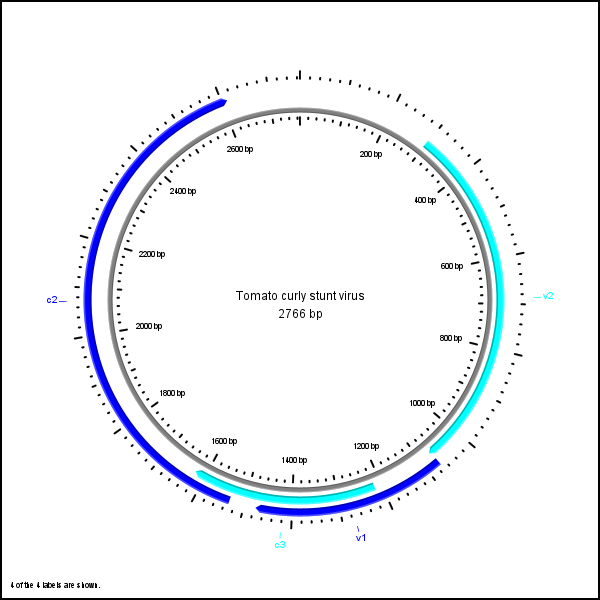

# Circular Genome Map of Tomato Curly Stunt Virus

## Initial Research
Before attempting to map this genome file, I first did research on the features of a Genbank file and what they mean, as well as on circular genome maps. I learned about how these maps are used for the visualization of the many genes that make up a genome squence of an organism. Next, I searched for existing libraries that map genomic data into a circular genome map. I found the CGView Java package and decided to use it because of the flexibility in map features and high quality maps it can generate. 

## Solution
In order to create the map, I first had to find a way to parse the data from the Genbank file and pass it to the CGView builder. I searched for a parser online but couldn't find one that parsed Genbank files in Java, so I decided to take on the challenge and code it myself. I mainly used the Java Scanner class to successfully parse the data, which was the most time consuming aspect of my solution. I then passed this data to CGView objects to create the features for each gene in the genome, and decided to alternate the feature slots to make it easier for visualization.

## Outcome
All in all, I'm happy with how the map turned out and really enjoyed learning about this aspect of Bioinformatics. I hope to do more research in this field in the future.

### Resources
[Stothard P, Wishart DS. Circular genome visualization and exploration using CGView. Bioinformatics. 2005 Feb 15;21(4):537-9. doi: 10.1093/bioinformatics/bti054. Epub 2004 Oct 12. PMID: 15479716.](https://pubmed.ncbi.nlm.nih.gov/15479716/)
